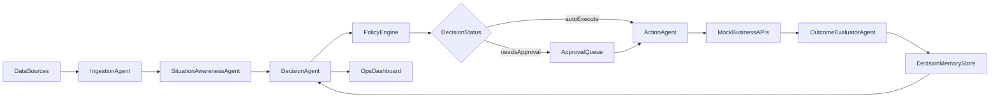

# Autonomous AI Ops Manager

**Author:** [@Nickfuse21](https://github.com/Nickfuse21)


A local-first **autonomous decision engine** that monitors business data, detects anomalies, makes strategic decisions under uncertainty, executes actions, and learns from outcomes — the full agentic AI loop running on your machine.

Built to be:

- **Portfolio-grade** — impressive enough that recruiters and hiring managers take notice.
- **Interview-ready** — every feature maps to a real production pattern you can explain.
- **Beginner-friendly** — runs locally with no cloud accounts or API keys required.

## What the System Does

```
Business Data → Anomaly Detection → Situation Analysis → Hybrid Decision →
Action Execution → Outcome Evaluation → Memory Update → Better Future Decisions
```

1. **Ingests** raw business events (sales, traffic, conversions, inventory).
2. **Detects** statistical anomalies and classifies the business situation.
3. **Decides** the best action using a hybrid scoring engine (rules + ML forecast + reasoning).
4. **Executes** the action via mock business APIs with idempotency and retry logic.
5. **Evaluates** the outcome by comparing pre/post KPIs.
6. **Learns** by storing the decision context in a vector memory for future retrieval.

## Architecture



## Tech Stack

| Layer | Technology |
|-------|-----------|
| Backend | FastAPI + Python |
| Decision Intelligence | Rule policy + lightweight forecast + reasoning heuristic |
| Memory | Local vector-like retrieval + JSON persistence |
| Frontend | React + Vite + TypeScript |
| Infra | Optional Docker Compose |

## Dashboard Features

The frontend is a full operations dashboard — not just a demo page:

- **Sticky Navbar** with live backend health indicator and auto-refresh toggle.
- **Pipeline Visualization** — animated 6-step pipeline showing Ingest → Detect → Decide → Execute → Evaluate → Learn, each step lights up as the cycle runs.
- **8 KPI Metric Cards** — detected issue, chosen action, decision score, outcome, total decisions, executed count, average score, and revenue lift.
- **Tab Navigation** — Overview, Explainability, Approvals, and History tabs for organized depth.
- **Decision Run Summary** — full trace of the latest cycle with every data point.
- **Explainability Panel** — every candidate action with visual score bars for rule, ML, and reasoning scores so you can see exactly why one action was chosen over another.
- **Scenario Simulator Tab** — adjust sales/traffic/conversion/price/cost shocks with sliders and run custom decision cycles.
- **Trend Analytics** — built-in charts for decision score trend, outcome trend, and action distribution.
- **Human Approval Queue** — when running in approval mode, decisions land in a queue with Approve/Reject controls.
- **Decision History** — persistent log of all past cycles with outcome badges.
- **Two-Column Architecture View** — how the system works (6-stage loop) and technical patterns (governance, audit trail, idempotency, memory, observability).
- **Report Export** — download a comprehensive JSON report of the latest run.

## Folder Structure

```
backend/
  app/
    agents/         # ingestion, awareness, decision, action, outcome
    api/            # FastAPI routes
    core/           # structured logging with trace IDs
    memory/         # vector store with local persistence
    models/         # sales forecasting interface
    policy/         # governance rules and risk gating
    services/       # orchestration engine
    storage/        # local JSON audit store
  tests/            # integration tests
  scripts/          # demo runner
data/simulated/     # reproducible sales-drop scenario
frontend/
  src/
    components/     # DecisionTimeline, PipelineViz, ScoreBar
    pages/          # Dashboard (main UI)
    styles.css      # full visual theme
infra/              # docker-compose.yml
scripts/            # check_prereqs.ps1, smoke_test.ps1
```

## Quick Start (Local)

```powershell
cd .\autonomous-ai-ops-manager

# Run smoke test (installs deps, runs tests, executes demo cycle)
.\scripts\smoke_test.ps1

# Start backend
cd .\backend
.\.venv\Scripts\python.exe -m uvicorn app.main:app --reload --port 8000
```

In a second terminal:

```powershell
cd .\autonomous-ai-ops-manager\frontend
npm install
npm run dev
```

Open `http://localhost:5173` and click **Run Decision Cycle**.

## Environment variables

| Context | Variable | Purpose |
|---------|----------|---------|
| Backend | `CORS_ORIGINS` | Comma-separated browser origins (default `*` for local dev). Example: `https://app.example.com,http://localhost:5173` |
| Frontend (Vite) | `VITE_API_BASE` | API origin without trailing slash (default `http://localhost:8000`). The UI calls `{VITE_API_BASE}/api/...`. |

Create `frontend/.env.production` for deploy builds, e.g. `VITE_API_BASE=https://api.example.com`.

## Test Commands

Backend integration tests:

```powershell
cd .\backend
.\.venv\Scripts\python.exe -m pytest -q
```

Frontend build check:

```powershell
cd .\frontend
npm run build
```

## API Endpoints

| Method | Endpoint | Purpose |
|--------|----------|---------|
| GET | `/api/health` | Health check |
| GET | `/api/dashboard` | Bootstrap payload: impact, approvals, decisions slice, `server_time` |
| POST | `/api/cycle/run` | Run full cycle on provided events |
| POST | `/api/cycle/demo` | Run cycle on sample scenario |
| GET | `/api/decisions` | View audit summaries |
| GET | `/api/impact-summary` | Business impact metrics |
| GET | `/api/approvals` | List pending human approvals |
| POST | `/api/approvals/{id}/approve` | Approve and execute |
| POST | `/api/approvals/{id}/reject` | Reject pending action |

## Where Data Is Stored

- `backend/storage/audit_log.json` — decision history (persists across restarts)
- `backend/storage/memory.json` — learned context from past runs

## Docker Run (Optional)

```bash
cd infra
docker compose up --build
```

Backend: `http://localhost:8000` · Frontend: `http://localhost:5173`

## Interview Demo Script (3 minutes)

1. Open dashboard — point out the pipeline visualization, KPI cards, and health indicator.
2. Run one cycle in **Autonomous** mode — watch the pipeline animate through all 6 stages.
3. Click the **Explainability** tab — show the score bar breakdown for each candidate action.
4. Switch to **Human Approval** mode — run another cycle and show it landing in the Approvals tab.
5. Approve the decision — watch the History tab and KPI metrics update.
6. Export the report JSON and show the persisted audit files in `backend/storage/`.

## Production Patterns Demonstrated

- **Governance** — policy engine enforces discount caps, budget limits, and confidence thresholds.
- **Human-in-the-Loop** — approval queue for high-impact decisions before execution.
- **Audit Trail** — every cycle writes a structured record to local storage.
- **Idempotency** — action agent tracks execution IDs to prevent duplicate side-effects.
- **Memory System** — vector similarity search over past decisions for context-aware reasoning.
- **Observability** — structured logs with trace IDs, live health endpoint, and impact metrics.
- **Explainability** — transparent score decomposition across three intelligence dimensions.

## Resume Line

> Built an Autonomous AI Decision Engine that monitors business data, detects anomalies, makes strategic decisions using hybrid intelligence (rules + ML + reasoning), executes actions with governance safeguards, and self-improves through feedback-driven memory — with a full operations dashboard featuring explainability, human approval workflows, and audit reporting.
